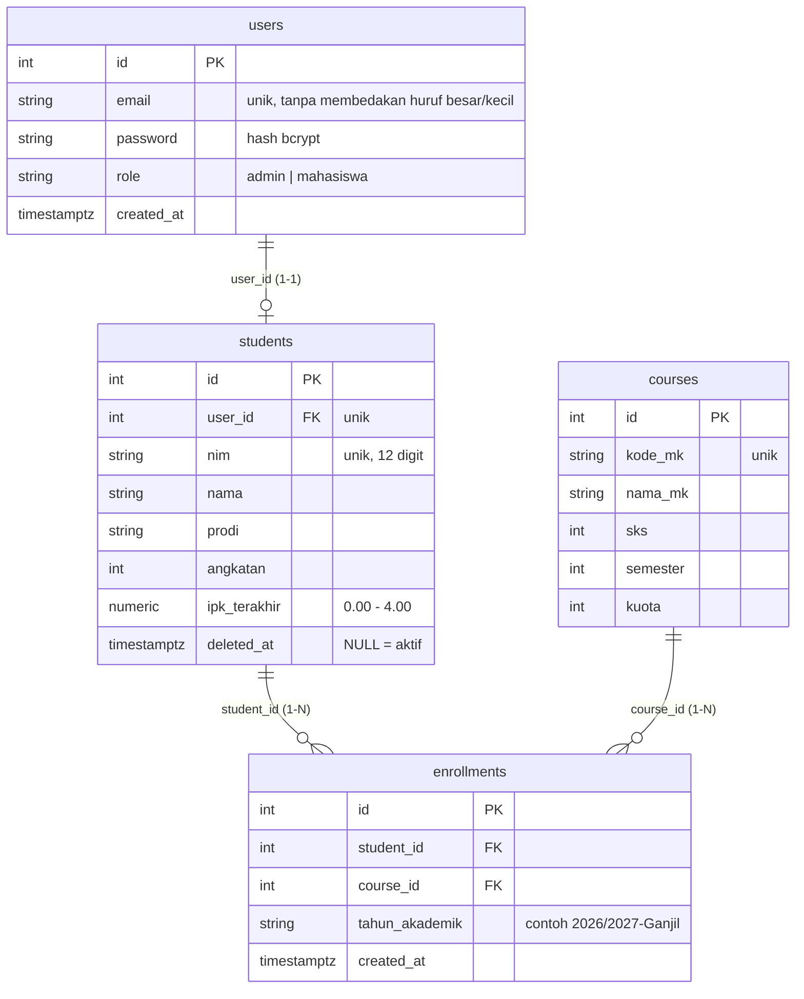

# SIAKAD Mini - RESTful API Backend

SIAKAD Mini adalah RESTful API backend untuk layanan akademik sederhana: data mahasiswa, mata kuliah, dan Kartu Rencana Studi (KRS).
API dipakai oleh dua peran: **admin** (mengelola mahasiswa) dan **mahasiswa** (melihat profil sendiri, mengambil dan membatalkan mata kuliah pada KRS).
Proyek ini dibuat untuk UTS Praktikum Pemrograman Backend Lanjut.

## Teknologi

- **Bahasa**: Go 1.22+
- **Web framework**: Fiber v2
- **Database**: PostgreSQL, driver `pgx/v5` (`pgxpool`), query SQL mentah tanpa ORM
- **Autentikasi**: JWT (HS256), password di-hash dengan bcrypt (cost 12)
- **Keamanan**: Helmet, CORS terbatas, rate limiter login, batas ukuran body
- **Validasi**: `go-playground/validator/v10` dengan pesan berbahasa Indonesia
- **Log**: `log/slog` berformat JSON ke layar dan `logs/app.log` (rotasi dengan lumberjack)

## Struktur Folder

```text
siakad-mini/
├── app/
│   ├── model/         # Struct entitas, request, dan response (tidak mengimpor package proyek lain)
│   ├── repository/    # SQL mentah, interface repository, dan sentinel error (tanpa Fiber / status HTTP)
│   └── service/       # Handler Fiber dan business rules murni (*_rules.go), tanpa SQL langsung
├── config/            # Env, logger, dan perakitan app Fiber beserta error handler
├── database/          # Connection pool pgxpool
├── helper/            # Fungsi bantu stateless: JWT, password, validator, response, AppError
├── middleware/        # Request ID, logger, recover, CORS, auth, role guard, rate limiter
├── route/             # Daftar URL ke handler beserta penjaganya, tanpa logika
├── migrations/        # Migrasi SQL (4 tabel)
├── seeds/             # Seeder: 1 admin, 20 mahasiswa, 10 mata kuliah
└── main.go            # Perakitan dependency dan graceful shutdown
```

### Arsitektur

Struktur mengikuti Clean Architecture versi mata kuliah. Aturan utamanya: dependency hanya mengarah ke dalam.

| Layer Clean Architecture | Folder |
|---|---|
| 1. Entities | `app/model` |
| 2. Use Cases | bagian aturan di `app/service` (`*_rules.go`) |
| 3. Interface Adapters | `app/repository` (gateway), `helper` (presenter), method `app/service` yang memegang `fiber.Ctx` (controller) |
| 4. Frameworks & Drivers | `config`, `database`, `middleware`, `route`, `main.go` |

```text
route ──► service ──► repository ──► model
middleware ──► helper ──► model
config ──► route, middleware, helper
main ──► config, database, repository, service
```

Penyederhanaan yang disengaja: `service` merangkap controller (menerima `fiber.Ctx`), dan interface repository disimpan
satu package dengan implementasinya. Karena itu business rules (batas SKS, tahun akademik, normalisasi pagination)
ditulis sebagai fungsi murni di file terpisah agar bisa diuji tanpa server maupun database.

## Menyiapkan dari Nol

Prasyarat: Go 1.22+, PostgreSQL 16+, dan Git. Perintah di bawah untuk Windows PowerShell.

```powershell
git clone https://github.com/USERNAME/siakad-mini.git
cd siakad-mini

# 1. Siapkan psql (sesuaikan nomor versi dengan instalasi PostgreSQL Anda)
$psql = "C:\Program Files\PostgreSQL\18\bin\psql.exe"
$env:PGPASSWORD = "password_postgres_anda"

# 2. Buat database dan jalankan migrasi secara berurutan
& $psql -U postgres -c "CREATE DATABASE siakad_mini;"
& $psql -U postgres -d siakad_mini -f migrations/001_create_users.sql
& $psql -U postgres -d siakad_mini -f migrations/002_create_students.sql
& $psql -U postgres -d siakad_mini -f migrations/003_create_courses.sql
& $psql -U postgres -d siakad_mini -f migrations/004_create_enrollments.sql

# 3. Konfigurasi environment
Copy-Item .env.example .env
# Buka .env, isi nilainya (lihat tabel di bawah), lalu buat JWT_SECRET dengan perintah ini:
-join ((1..64) | ForEach-Object { '{0:x}' -f (Get-Random -Maximum 16) })

# 4. Unduh dependency, isi data awal, jalankan server
go mod tidy
go run ./seeds
go run .
```

Server berjalan di `http://localhost:3000`. Cek dengan `curl.exe -i http://localhost:3000/api/v1/health` (harus 200).
Urutan migrasi penting: `students` bergantung pada `users`, dan `enrollments` bergantung pada `students` dan `courses`.

## Variabel Environment

Salin `.env.example` menjadi `.env`. Berkas `.env` tidak boleh di-commit.

| Variabel | Fungsi | Contoh | Wajib |
|---|---|---|---|
| `APP_NAME` | Nama aplikasi | `SIAKAD Mini` | Tidak |
| `APP_ENV` | `development` atau `production`; pada `production` detail error 500 tidak dikirim ke klien | `development` | Tidak |
| `APP_PORT` | Port server | `3000` | Tidak |
| `DB_HOST` | Host PostgreSQL | `localhost` | Ya |
| `DB_PORT` | Port PostgreSQL | `5432` | Ya |
| `DB_USER` | User PostgreSQL | `postgres` | Ya |
| `DB_PASSWORD` | Password PostgreSQL | `rahasia` | Ya |
| `DB_NAME` | Nama database | `siakad_mini` | Ya |
| `DB_SSLMODE` | Mode SSL (`disable` hanya untuk lokal) | `disable` | Tidak |
| `DB_MAX_CONNS` | Maksimum koneksi pada pool | `10` | Tidak |
| `JWT_SECRET` | Kunci penanda tangan token, **minimal 32 karakter** (aplikasi menolak menyala bila kurang) | hasil perintah di atas | Ya |
| `JWT_ISSUER` | Penerbit token | `siakad-mini` | Tidak |
| `JWT_ACCESS_TTL_MINUTES` | Umur access token (menit) | `60` | Tidak |
| `ALLOWED_ORIGINS` | Origin yang diizinkan CORS | `http://localhost:3000` | Tidak |
| `LOG_LEVEL` | `debug`, `info`, `warn`, `error` | `info` | Tidak |
| `SEED_ADMIN_EMAIL` | Email admin yang dibuat seeder | `admin@siakad.test` | Tidak |
| `SEED_ADMIN_PASSWORD` | Password admin yang dibuat seeder | `Admin12345!` | Tidak |

## Skema Database



Constraint penting dan alasannya:

- `UNIQUE (student_id, course_id, tahun_akademik)` pada `enrollments`: mahasiswa tidak bisa mengambil mata kuliah yang sama dua kali pada tahun akademik yang sama. Dijaga database, sehingga tetap aman bila dua request datang bersamaan.
- Indeks unik `LOWER(email)` pada `users`: email unik tanpa membedakan huruf besar/kecil.
- `CHECK` pada `role`, `nim` (12 digit), `ipk_terakhir` (0-4), `sks`, `semester`, `kuota`, dan format `tahun_akademik`: data tidak valid ditolak walaupun masuk lewat jalur selain API.
- `students.deleted_at`: soft delete. NIM tetap unik walau barisnya sudah di-soft-delete, jadi NIM tidak dapat dipakai ulang.
- `ipk_terakhir` bernilai `0.00` bila tidak diisi, sehingga mahasiswa tanpa IPK otomatis mendapat batas SKS paling ketat (18).

## Akun Seed

`go run ./seeds` mengisi 1 admin, 20 mahasiswa, dan 10 mata kuliah. Seeder aman dijalankan berulang kali (data yang sudah ada dilewati).

| Peran | Email | Password |
|---|---|---|
| Admin | `admin@siakad.test` | `Admin12345!` |
| Mahasiswa | `<NIM>@student.siakad.test` | sama dengan NIM |

Contoh mahasiswa (NIM = `1872` + dua digit angkatan + nomor urut enam digit), dipilih agar semua batas SKS dapat diuji:

| Nama | NIM | IPK | Batas SKS |
|---|---|---|---|
| Rina Putri | `187222000001` | 3.45 | 24 |
| Dimas Pratama | `187221000004` | 3.00 | 24 |
| Intan Permata | `187223000009` | 2.99 | 21 |
| Lutfi Hakim | `187221000012` | 2.50 | 21 |
| Oki Ramadhan | `187224000015` | 2.49 | 18 |
| Tegar Saputra | `187221000020` | 0.00 | 18 |

Mata kuliah `TI101` sampai `TI110`. `TI109` berkuota 3 dan `TI110` berkuota 2, agar kasus kuota penuh mudah diuji.

## Business Rules

| # | Aturan | Ditegakkan di |
|---|---|---|
| 1 | Batas SKS per tahun akademik: IPK >= 3,00 maks 24; 2,50-2,99 maks 21; < 2,50 maks 18 | Fungsi murni `MaxSKS` dan `CheckSKS` (`app/service`), dipakai dalam transaction KRS |
| 2 | Mata kuliah yang sama tidak boleh diambil dua kali pada tahun akademik yang sama | Pengecekan di transaction dan constraint `UNIQUE` di database (409) |
| 3 | Mata kuliah berkuota penuh tidak dapat diambil | Pengecekan `terisi >= kuota` di transaction; baris mata kuliah dikunci dengan `SELECT ... FOR UPDATE` agar aman terhadap request paralel (422) |
| 4 | Mahasiswa hanya mengakses dan mengubah data miliknya sendiri | Pengecekan kepemilikan di service, dilakukan sebelum data target diambil (403) |

`terisi` dan `sisa_kuota` selalu dihitung dari tabel `enrollments`, bukan disimpan sebagai kolom,
sehingga membatalkan KRS otomatis mengembalikan kuota tanpa langkah tambahan.

## Kontrak API

Basis URL: `http://localhost:3000/api/v1`. Semua endpoint kecuali login (dan `/health`) memerlukan header
`Authorization: Bearer <access_token>`. Body permintaan harus `Content-Type: application/json`.

| No | Metode | Endpoint | Akses | Status sukses | Status error |
|---|---|---|---|---|---|
| 1 | POST | `/auth/login` | Publik | 200 | 401, 422, 429 |
| 2 | GET | `/auth/me` | Semua role | 200 | 401 |
| 3 | GET | `/students` | Admin | 200 | 401, 403 |
| 4 | POST | `/students` | Admin | 201 | 401, 403, 422 |
| 5 | GET | `/students/{id}` | Admin, mahasiswa (data sendiri) | 200 | 401, 403, 404 |
| 6 | PUT | `/students/{id}` | Admin | 200 | 401, 403, 404, 422 |
| 7 | DELETE | `/students/{id}` | Admin | 204 | 401, 403, 404 |
| 8 | GET | `/courses` | Semua role | 200 | 401 |
| 9 | POST | `/enrollments` | Mahasiswa | 201 | 401, 403, 409, 422 |
| 10 | DELETE | `/enrollments/{id}` | Mahasiswa (milik sendiri) | 204 | 401, 403, 404 |

Endpoint tambahan `GET /health` (publik) memeriksa server dan database: 200, atau 503 bila database tidak terjangkau.

Status di luar tabel: **400** (ID bukan angka positif, atau body bukan JSON yang sah), **415** (`Content-Type` bukan JSON pada
POST/PUT), **413** (body melebihi 1 MB), dan **500** (kesalahan server; tanpa stack trace).

Semua response memakai amplop yang sama:

```json
{ "success": true, "message": "...", "data": {}, "meta": {} }
{ "success": false, "message": "...", "errors": { "field": ["pesan"] } }
```

Peta hak akses diatur di `route/route.go`: endpoint 3, 4, 6, 7 dijaga `RequireRole(admin)`; endpoint 9 dan 10 dijaga
`RequireRole(mahasiswa)` sehingga admin mendapat 403. Endpoint 5 sengaja tanpa `RequireRole` karena keputusannya
bergantung pada id yang diminta (admin atau pemilik data), sehingga diputuskan di service.

### 1. POST /auth/login

Body: `email` (wajib, format email), `password` (wajib, min. 8 karakter).
Login gagal lebih dari 5 kali per menit dari satu IP dijawab 429 dengan header `Retry-After`.

```json
{ "email": "admin@siakad.test", "password": "Admin12345!" }
```

Response 200:

```json
{
  "success": true,
  "message": "Login berhasil",
  "data": {
    "access_token": "eyJhbGciOi...",
    "token_type": "Bearer",
    "expires_in": 3600,
    "user": { "id": 1, "email": "admin@siakad.test", "role": "admin" }
  }
}
```

Response 401 (email tidak ada dan password salah memakai pesan yang sama):

```json
{ "success": false, "message": "Email atau password salah" }
```

### 2. GET /auth/me

Response 200 untuk mahasiswa (untuk admin, `student` tidak ada):

```json
{
  "success": true,
  "message": "Profil berhasil diambil",
  "data": {
    "user": { "id": 2, "email": "187222000001@student.siakad.test", "role": "mahasiswa" },
    "student": { "nim": "187222000001", "nama": "Rina Putri", "prodi": "Sistem Informasi", "angkatan": 2022 }
  }
}
```

### 3. GET /students

Query: `page` (bawaan 1), `per_page` (bawaan 10, maks 50), `prodi`, `angkatan`,
`search` (NIM atau nama), `sort` (`nama` atau `-ipk_terakhir`; nilai lain diabaikan).

```text
GET /api/v1/students?page=1&per_page=5&search=rina&sort=-ipk_terakhir
```

Response 200:

```json
{
  "success": true,
  "message": "Data mahasiswa berhasil diambil",
  "data": [
    { "id": 1, "nim": "187222000001", "nama": "Rina Putri", "prodi": "Sistem Informasi", "angkatan": 2022, "ipk_terakhir": 3.45 }
  ],
  "meta": { "current_page": 1, "per_page": 5, "total": 1, "last_page": 1 }
}
```

### 4. POST /students

Membuat akun user (role `mahasiswa`, password awal = hash NIM) dan data mahasiswa dalam satu transaction.
Header `Location` berisi alamat mahasiswa baru.

```json
{
  "nim": "187222000099",
  "nama": "Contoh Mahasiswa",
  "email": "contoh@student.siakad.test",
  "prodi": "Teknik Informatika",
  "angkatan": 2022,
  "ipk_terakhir": 3.2
}
```

Response 422 (NIM duplikat):

```json
{
  "success": false,
  "message": "Validasi gagal",
  "errors": { "nim": ["NIM sudah terdaftar"] }
}
```

### 5. GET /students/{id}

Admin dapat membuka mahasiswa mana pun; mahasiswa hanya dirinya sendiri (403 untuk yang lain).
Mahasiswa yang tidak ada atau sudah di-soft-delete dijawab 404. Query opsional `tahun_akademik`
(bawaan: tahun akademik berjalan) menentukan periode `courses` dan `total_sks`.

```json
{
  "success": true,
  "message": "Detail mahasiswa berhasil diambil",
  "data": {
    "id": 1, "nim": "187222000001", "nama": "Rina Putri", "prodi": "Sistem Informasi",
    "angkatan": 2022, "ipk_terakhir": 3.45,
    "courses": [
      { "enrollment_id": 7, "course_id": 1, "kode_mk": "TI101", "nama_mk": "Algoritma dan Pemrograman", "sks": 3, "tahun_akademik": "2026/2027-Ganjil" }
    ],
    "total_sks": 3,
    "batas_sks": 24
  }
}
```

### 6. PUT /students/{id}

Body: `nama`, `prodi`, `angkatan`, `ipk_terakhir`. NIM tidak boleh diubah (mengirim `nim` dijawab 422).
Bila `ipk_terakhir` tidak dikirim, nilai lama dipertahankan.

### 7. DELETE /students/{id}

Soft delete: mengisi `deleted_at`. Mahasiswa tersebut tidak muncul di daftar dan tidak dapat login. Response 204 tanpa body.

### 8. GET /courses

Query: `semester`, `search` (kode atau nama), `available=true` (hanya yang kuotanya belum penuh),
`tahun_akademik` (opsional, bawaan tahun akademik berjalan).

```json
{
  "success": true,
  "message": "Data mata kuliah berhasil diambil",
  "data": [
    { "id": 10, "kode_mk": "TI110", "nama_mk": "Etika Profesi", "sks": 2, "semester": 6, "kuota": 2, "terisi": 1, "sisa_kuota": 1 }
  ]
}
```

### 9. POST /enrollments

Hanya mahasiswa (admin dijawab 403). Seluruh pengecekan berjalan dalam satu transaction
dengan urutan: duplikasi (409), kuota (422), batas SKS (422).

```json
{ "course_id": 1, "tahun_akademik": "2026/2027-Ganjil" }
```

Response 201 (header `Location: /api/v1/enrollments/{id}`):

```json
{
  "success": true,
  "message": "Mata kuliah berhasil ditambahkan ke KRS",
  "data": { "id": 7, "student_id": 1, "course_id": 1, "tahun_akademik": "2026/2027-Ganjil", "created_at": "2026-10-10T08:00:00Z" }
}
```

Response 422 (batas SKS):

```json
{
  "success": false,
  "message": "Total SKS melebihi batas 18 SKS (IPK 2.49). SKS terpakai 16, sisa 2, mata kuliah ini 4 SKS."
}
```

Response 409:

```json
{ "success": false, "message": "Mata kuliah ini sudah Anda ambil pada tahun akademik tersebut" }
```

### 10. DELETE /enrollments/{id}

Hanya pemilik KRS. Milik mahasiswa lain dijawab 403, id yang tidak ada dijawab 404. Response 204 tanpa body.
Kuota mata kuliah otomatis bertambah karena `terisi` dihitung dari tabel `enrollments`.

## Keputusan Desain dan Asumsi

- **"Per semester" berarti per `tahun_akademik`** (contoh `2026/2027-Ganjil`). Batas SKS dihitung dari total SKS mahasiswa pada tahun akademik yang sama.
- **Tahun akademik bawaan** (untuk `total_sks` dan `sisa_kuota` bila klien tidak mengirimnya): Agustus-Januari menjadi Ganjil, Februari-Juli menjadi Genap.
- **Token stateless.** Role dan status mahasiswa tidak diperiksa ulang ke database pada tiap request. Konsekuensinya, bila role berubah atau
  mahasiswa di-soft-delete, token lama tetap berlaku sampai kedaluwarsa (`JWT_ACCESS_TTL_MINUTES`). Login baru tetap ditolak untuk mahasiswa yang sudah dihapus. Tidak ada refresh token.
- **Rate limit login per alamat IP**, hanya menghitung login yang gagal.
- **Pesan login seragam** untuk email tidak ada dan password salah, dan hash bcrypt tetap dihitung untuk email yang tidak ada,
  agar daftar akun tidak dapat ditebak dari pesan maupun waktu tanggap.
- **Pengecekan hak akses sebelum pengambilan data** pada detail mahasiswa: mahasiswa yang membuka id orang lain selalu mendapat 403,
  sehingga tidak ada selisih 403/404 yang membocorkan keberadaan data.
- **Urutan pengecekan pada route ber-body**: `RequireJSON` dijalankan sebelum `RequireAuth`, sehingga POST/PUT tanpa `Content-Type: application/json`
  dijawab 415 sebelum token diperiksa. Permintaan tanpa token yang bertipe JSON dijawab 401.
- **Keunikan dijaga database** (NIM, email, KRS ganda), bukan hanya oleh kode Go. Pelanggaran diterjemahkan menjadi 422 (NIM/email) atau 409 (KRS ganda).
- **`PUT /students/{id}` tidak mengubah NIM dan email**, sesuai ketentuan soal. Bila `ipk_terakhir` tidak dikirim, nilai lama dipertahankan.
- **Password awal mahasiswa = NIM** (di-hash bcrypt cost 12), sesuai soal.
- **Status 500 tidak membocorkan stack trace.** Pada `APP_ENV=production` detail error tidak dikirim sama sekali; stack trace hanya masuk `logs/app.log`.

## Menjalankan Tes

```powershell
go vet ./...
go test ./...
go test ./... -v
```

Tes tidak membutuhkan database maupun server yang menyala. Cakupannya:

| Package | Yang diuji |
|---|---|
| `app/service` | batas SKS dari IPK (termasuk titik batas 3.00, 2.99, 2.50, 2.49), pengecekan dan pesan sisa SKS, tahun akademik berjalan, normalisasi pagination |
| `helper` | JWT (sukses, kedaluwarsa, secret salah, `alg=none`), hash password, validator (nama field JSON, pesan berbentuk array), meta pagination |